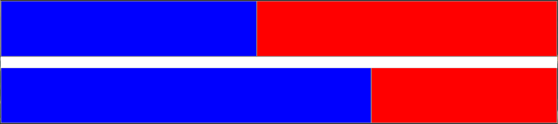

# tracedraw.sty
LaTeX package for drawing timelines oriented to represent parallel programs executions.

## Usage
Checkout [tutorial](doc/tutorial.md) for a tutorial on usage.

Checkout [description](doc/description.md) for a detailed description of all the commands the package supply.

## Instalation
TODO

## License
This project is licensed under GPL3. See LICENSE file for more details.
