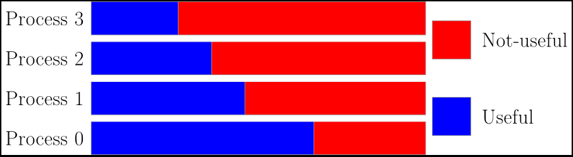

# tracedraw.sty
LaTeX package for drawing timelines oriented to represent parallel programs executions.



## Usage
Checkout [tutorial](doc/tutorial.md) for a tutorial on usage.

Checkout [description](doc/description.md) for a detailed description of all the commands the package supply.

## Instalation

### Using TEXMF

Use the [install](install) script or manually:

First, check if your LaTeX installation uses TEXMF.

```bash
kpsewhich -var-value=TEXMFHOME
```

This will print a directory where you can install packages.
Create a path where install the packages inside your TEXMFHOME:

```bash
mkdir -p $(kpsewhich -var-value=TEXMFHOME)/tex/latex/commonstuff
```
Then clone the repo, and copy the sty file into de created folder:

```bash
git clone https://github.com/teleportex/tracedraw.sty
cp tracedraw.sty/src/tracedraw.sty $(kpsewhich -var-value=TEXMFHOME)/tex/latex/commonstuff/
```

Check if the package is installed:
```bash
kpsewhich tracedraw.sty #It should print the path where is installed
```
And done!

## License
This project is licensed under GPL3. See LICENSE file for more details.

## Author
Guillem Ramírez Miranda. [teleportex](https://github.com/teleportex) on github.
